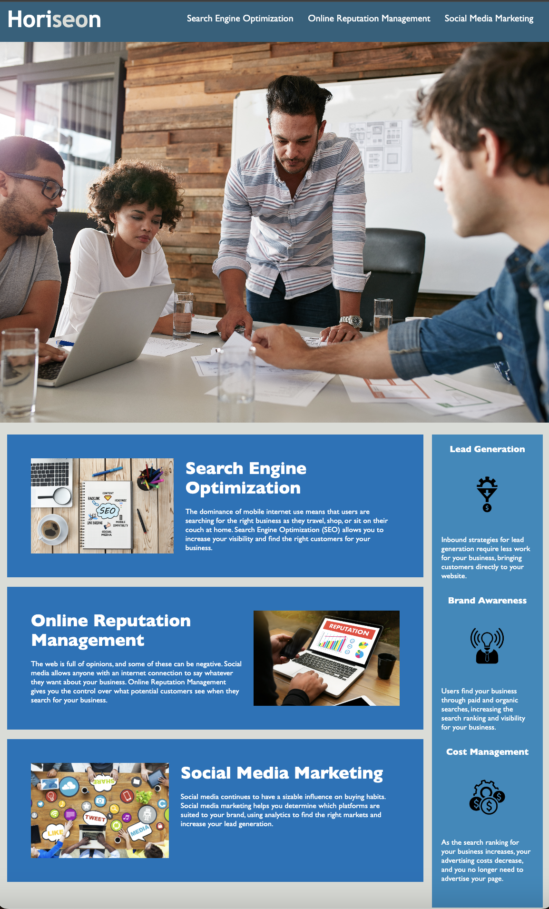

# SUBMISSION-1
* This challenge involved modifying code to make a marketing website more accessible. 

## Motivation
* The motivation was to ensure that people with disabilities can access a website using assistive technologies such as video captions, screen readers, and braille keyboards. 

* I built this website to be inform users of the marketing agency's services more inclusively. A key issue I resolved was to add Semantic HTML elements so that blind or partially sighted users with screen readers could use this element to determine whether to omit the initial rendering of this content. 

## Learning Outcomes
* I learned that Semantic HTML elements do more than allow data to be shared and reused across applications, enterprises, and communities.

## Project Outputs
* This project stands out because it demonstrates how websites are used by users of varying abilities in the real world. 

    

